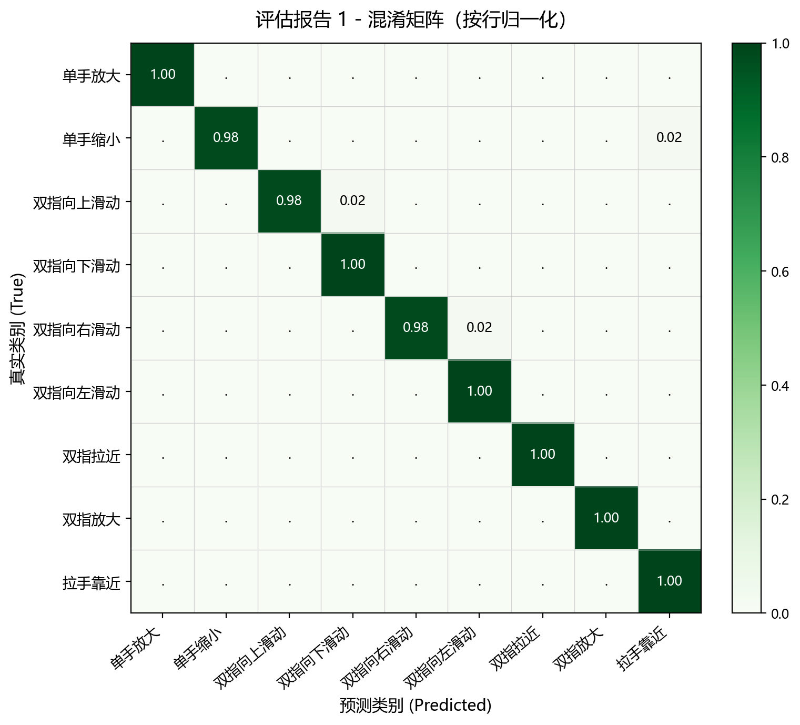

# 基于 ST-GCN 的实时手势识别系统

> 用 Mediapipe 提取手部 21 个关键点，将 RGB 视频流转为骨架时序数据；改造 ST-GCN 使其适配手部拓扑结构，并通过 **多流 Late Fusion**（joint / bone / motion）+ **注意力机制** 实现 9 类动态手势的实时识别，部署在笔记本前置摄像头上端到端运行。

[](https://www.python.org/)
[](https://pytorch.org/)
[](https://developers.google.com/mediapipe)
[](LICENSE)

---

## 📌 项目亮点

- **从数据到部署的完整流水线**：数据预处理 → 关键点提取 → 模型训练 → 多流融合评估 → 实时推理 GUI。
- **针对手部拓扑改造的 ST-GCN**：在原版 ST-GCN（Yan et al., AAAI 2018）基础上修改图结构与分区策略，使空域图卷积适配 21 节点手部骨架；增加网络深度并引入注意力模块。
- **多流 Late Fusion**：训练 joint / bone / motion 三个独立流，推理阶段以加权置信度融合，相比单流模型取得稳定提升。
- **状态机驱动的实时系统**：IDLE → PREPARE → DETECT → COOLDOWN 四态切换，结合手部位移阈值判定，避免无效推理与误触发。
- **可视化齐全**：网络结构图、手部图拓扑/邻接矩阵/分区策略、训练曲线、各流 / 融合后混淆矩阵均已生成并提供脚本复现。

---

## 🎬 效果演示

### Mediapipe 关键点提取效果

https://github.com/user-attachments/assets/413836fa-fb95-42bc-82d0-309ec7951ed0

https://github.com/user-attachments/assets/c51e2d90-3229-48d3-a341-60668f7f3518

### 实时手势识别系统

画面左上角显示系统状态（静止 / 预备 / 检测 / 冷却），右上角显示当前与历史识别结果及置信度。

https://github.com/user-attachments/assets/47cf0e30-e7c9-40e1-a928-615603688c53

https://github.com/user-attachments/assets/768ec158-62f3-4162-9a84-6d85720529b8

---

## 🧠 方法概述

### 1. 数据 & 关键点提取

- **数据集**：高通 [Jester](https://www.qualcomm.com/developer/software/jester-dataset)，从中筛选 9 类与人机交互强相关的动态手势：

  > 单手放大 / 单手缩小 / 双指向上滑动 / 双指向下滑动 / 双指向右滑动 / 双指向左滑动 / 双指拉近 / 双指放大 / 拉手靠近

- **姿态估计**：[MediaPipe Hands](https://developers.google.com/mediapipe/solutions/vision/hand_landmarker)，每帧输出 21 个手部关键点 (x, y, z)。
- **缺帧补偿**：对漏检帧使用三次样条插值（[`scipy.interpolate`](https://docs.scipy.org/doc/scipy/reference/interpolate.html)），统一对齐到 `T = 35` 帧。
- **多流构造**：在 joint 数据基础上派生 bone（相邻关键点差分）与 motion（相邻帧差分）两路输入。

### 2. 网络结构

基于 ST-GCN，改动如下：

| 模块 | 改动 |
| --- | --- |
| 图结构 | 重新定义手部 21 节点邻接矩阵与分区策略（root / centripetal / centrifugal） |
| 网络深度 | 堆叠 10 层 ST-GCN block，逐步增加通道维度 |
| 注意力 | 在每个 block 输出后加入空间注意力，按节点重要性加权 |
| 时间维度 | TCN 卷积核覆盖 9 帧感受野 |

输入张量形状：`(N, C=3, T=35, V=21, M=1)`，输出 9 类置信度。

> 可视化：[`visualization/hand_graph_topology.png`](visualization/hand_graph_topology.png:1)、[`visualization/hand_graph_partitions.png`](visualization/hand_graph_partitions.png:1)、[`visualization/st_gcn_arch_diagram.png`](visualization/st_gcn_arch_diagram.png:1)

### 3. 多流 Late Fusion

```
joint_logits  ──┐
bone_logits   ──┼──►  softmax & 加权求和  ──►  argmax  ──►  类别
motion_logits ──┘
```

权重由各流在验证集上的准确率确定（`joint=1.0 / bone=0.90 / motion=0.82`），见 [`gesture_app_with_camera.py`](gesture_app_with_camera.py:20)。

### 4. 实时系统状态机

```
        位移 > 阈值                  到时
IDLE ─────────────────► PREPARE ─────────► DETECT
  ▲                                          │
  │                                          ▼
  └──────  COOLDOWN  ◄───────────────  推理输出
              已冷却 2s
```

- `IDLE`：监测手部位移，连续静止 1s 后才允许触发。
- `PREPARE`：0.5s 倒计时，给用户做好动作的时间。
- `DETECT`：以滑窗 (`stride=5`) 推理，达到置信度阈值即输出。
- `COOLDOWN`：2s 冷却，避免连击误触。

---

## 📊 模型评估

> **关于测试集**：测试集由 [`data/unified_keypoint_extraction.py`](data/unified_keypoint_extraction.py:1) 自动从 Jester 数据集划分生成，但脚本无法识别"标注正确但视觉上无法辨认动作类别"的脏样本。为此我对自动生成的测试集做了一次**人工复检**：随机抽样可视化每条样本的关键点序列，剔除手势完全看不出动作意图（手部脱离画面、严重遮挡、关键点漂移）的样本，最终保留 **9 类 × 50 = 450** 条干净样本作为评估集。

为对比建模选择对系统部署的影响，分别评估了一个**高精度版本**和一个**轻量版本**：

| 指标 | 高精度版本 | 轻量版本 |
| --- | :---: | :---: |
| 总体准确率 | **99.33%** | 98.44% |
| 模型参数量 | 4.13 M | **1.38 M** (-67%) |
| 单样本批量推理耗时 | 1.37 ms | **0.45 ms** |
| 批量推理吞吐量 | 727 FPS | **2209 FPS** |
| 单样本实时推理延迟 | 45.62 ms | **14.75 ms** |
| 实时推理帧率 (batch=1) | 21.92 FPS | **67.81 FPS** |
| 评估报告 | [`evaluation_report1.xlsx`](visualization/evaluation_report1.xlsx) | [`evaluation_report2.xlsx`](visualization/evaluation_report2.xlsx) |

> 轻量版本以约 0.9pp 准确率为代价，把参数量压到原来的 1/3、实时帧率提到 3 倍以上，更适合部署在笔记本前置摄像头这类资源受限场景。

### 各类别详细分类指标（轻量版本）

| 动作类别 | Accuracy | Precision | Recall | F1-Score | 单样本耗时 (ms) |
| --- | :---: | :---: | :---: | :---: | :---: |
| 单手放大 | 1.0000 | 1.0000 | 1.0000 | 1.0000 | 0.45 |
| 单手缩小 | 0.9978 | 1.0000 | 0.9800 | 0.9899 | 0.44 |
| 双指向上滑动 | 0.9911 | 0.9600 | 0.9600 | 0.9600 | 0.44 |
| 双指向下滑动 | 0.9933 | 0.9796 | 0.9600 | 0.9697 | 0.44 |
| 双指向右滑动 | 1.0000 | 1.0000 | 1.0000 | 1.0000 | 0.44 |
| 双指向左滑动 | 1.0000 | 1.0000 | 1.0000 | 1.0000 | 0.44 |
| 双指拉近 | 0.9956 | 0.9615 | 1.0000 | 0.9804 | 0.44 |
| 双指放大 | 0.9978 | 0.9804 | 1.0000 | 0.9901 | 0.44 |
| 拉手靠近 | 0.9933 | 0.9796 | 0.9600 | 0.9697 | 0.55 |
| **平均 (Macro)** | **0.9965** | **0.9846** | **0.9844** | **0.9844** | **0.45** |

### 混淆矩阵可视化

| 高精度版本 | 轻量版本 |
| --- | --- |
|  |  |

完整数据（精确率 / 召回率 / F1 / 混淆矩阵 / 系统性能开销）见两份 Excel 评估报告。

---

## 📁 项目结构

```
ST-GCN/
├── data/                              # 数据处理脚本（不含原始数据）
│   ├── classify_dataset.py            #   按标注划分 Jester 数据集
│   ├── process_dataset.py             #   裁剪/重采样视频
│   ├── unified_keypoint_extraction.py #   关键点提取（支持补帧 & 多算法切换）
│   ├── keypoint_extraction.py         #   早期单算法版本
│   ├── generate_stream_data.py        #   生成 bone / motion 流数据
│   └── check_valid_frames.py          #   有效帧统计
│
├── st_gcn/
│   ├── graph/                         # 图结构定义（手部拓扑、邻接矩阵、分区）
│   ├── feeder/                        # PyTorch Dataset
│   │   └── hand_feeder_v4.py          #   当前使用的 Feeder
│   └── net/
│       ├── st_gcn_hand_v6.py          #   当前使用的网络（含注意力 & 多流支持）
│       ├── st_gcn.py                  #   原版 ST-GCN（参考实现）
│       ├── tcn.py / unit_gcn.py       #   时间/空间卷积单元
│       └── archive/                   #   历史迭代版本（v2~v5）
│
├── visualization/                     # 可视化脚本与结果
│   ├── visualize_hand_graph.py        #   绘制手部图结构与分区策略
│   ├── visualize_arch_diagram.py      #   绘制网络架构图
│   ├── confusion_matrix_heatmap.py    #   绘制混淆矩阵
│   ├── training_log_visualizer.py     #   解析训练日志并绘图
│   └── *.png / *.xlsx                 #   实验结果输出
│
├── test_samples/                      # 单样本调试用素材
│
├── tools/                             # 辅助测试脚本
│
├── train.py                           # 训练入口
├── test_model.py                      # 多流融合评估
├── real_time.py                       # 实时识别（命令行 / OpenCV 窗口）
├── gesture_app_with_camera.py         # 实时识别 GUI（CustomTkinter）
└── main.py                            # 兼容入口（参考原 ST-GCN 设计）
```

---

## 🚀 快速上手

### 1. 环境

```bash
git clone https://github.com/hhslhw/Gesture_Recognition.git
cd Gesture_Recognition
pip install -r requirements.txt   # 若无 requirements.txt，可手动安装下方依赖
```

主要依赖：

```
torch>=2.0
mediapipe>=0.10
opencv-python
numpy
scipy
scikit-learn
pandas
matplotlib
pillow
customtkinter
tensorboard
```

### 2. 模型权重下载

仓库未包含 `.pth` 权重文件（体积过大）。请将下载的权重放入 `models/` 目录：

```
models/
├── best_new.pth      # joint 流
├── best_bone.pth     # bone 流
└── best_motion.pth   # motion 流
```

> 权重获取：请发送邮件至2065610956@qq.com。

### 3. 实时手势识别 GUI

```bash
python gesture_app_with_camera.py
```

打开后选择前置摄像头即可开始识别。

### 4. 离线评估

```bash
python test_model.py
```

输出各流单独准确率与三流融合后的混淆矩阵 / 分类报告。

### 5. 从零训练

```bash
# Step 1. 划分数据集（基于 Jester 标注）
python data/classify_dataset.py

# Step 2. 提取关键点并补帧
python data/unified_keypoint_extraction.py

# Step 3. 生成 bone / motion 流（可选，用于多流训练）
python data/generate_stream_data.py

# Step 4. 训练
python train.py
```

训练日志会写入 `logs/` 与 `runs/`（TensorBoard）。

---

## 🔧 关键超参数

| 参数 | 值 | 位置 |
| --- | --- | --- |
| 时间窗口 `T` | 35 | [`train.py`](train.py:21) |
| 通道数 `C` | 3 (x, y, z) | [`train.py`](train.py:20) |
| 关键点数 `V` | 21 | Mediapipe Hand |
| Batch size | 16 | [`train.py`](train.py:22) |
| Epoch | 100 | [`train.py`](train.py:23) |
| 学习率 | 5e-4，CosineAnnealing | [`train.py`](train.py:24) |
| 优化器 | Adam | [`train.py`](train.py) |
| 注意力 | ✅ 开启 | [`train.py`](train.py:29) |

---

## 📝 致谢与参考

- 原始 ST-GCN：[yysijie/st-gcn](https://github.com/yysijie/st-gcn)
- 论文：Yan, Sijie, Yuanjun Xiong, and Dahua Lin. *"Spatial Temporal Graph Convolutional Networks for Skeleton-Based Action Recognition."* AAAI 2018. [[arXiv](https://arxiv.org/abs/1801.07455)]
- 数据集：Qualcomm Jester Dataset
- 关键点检测：[Google MediaPipe Hands](https://developers.google.com/mediapipe/solutions/vision/hand_landmarker)

## 📄 License

本项目基于 [MIT License](LICENSE) 开源。原 ST-GCN 部分代码遵循其原始许可。
